# Data Authorization

> Notice: This file is automatically generated by
> [generate_auth_docs.ts](../graphql/generate_auth_docs.ts).

Below you will find various diagrams that illustrates how to API restricts
access to data.

## How it works

This project is hosted behind an Azure API gateway that determines what data
can be returned by a given client via [subscriptions](https://learn.microsoft.com/en-us/azure/api-management/api-management-subscriptions).  Each subscription is tied to a
*product* which modifies the `x-auth-group` header sent to this service.  The
available values and filters are defined in the [auth.ts](../graphql/auth.ts)
file.

```javascript
// auth.ts
{
  "nml-lab": {},
  "csc": {
    "sites": {
      "where": [
        "healthReg",
        "CSC"
      ]
    }
  },
  "bccdc": {
    "datasets": {
      "where": [
        "dataID",
        "BCCDC"
      ]
    }
  },
  "hnj": {
    "sites": {
      "where": [
        "siteID",
        "HNJ"
      ]
    },
    "datasets": {
      "whereIn": [
        "dataID",
        [
          "NML-WWPCR",
          "NML-WWGX"
        ]
      ]
    }
  }
}
```

### Authorization flow

The process described above is illustrated below using a flow chart.


## SQL Query modifications

When the GraphQL server receives a request to access data in a particular table,
the foreign key relationships of the table are examined, and a query plan is
produced that enforces the rules declared in [auth.ts](../graphql/auth.ts).

The diagrams below illustrates what the resulting query plan is for each group
and table combination.


### nml-lab -> addresses


### nml-lab -> organizations


### nml-lab -> datasets


### nml-lab -> polygons


### nml-lab -> instruments


### nml-lab -> optionSets


### nml-lab -> setLUs


### nml-lab -> partLUs


### nml-lab -> contacts


### nml-lab -> measureSets

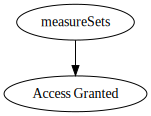


### nml-lab -> methodSteps


### nml-lab -> methodSets

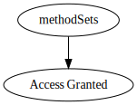


### nml-lab -> languageLUs


### nml-lab -> translationLUs


### nml-lab -> sites


### nml-lab -> samples


### nml-lab -> measures


### csc -> addresses


### csc -> organizations


### csc -> datasets


### csc -> polygons


### csc -> instruments


### csc -> optionSets


### csc -> setLUs


### csc -> partLUs


### csc -> contacts


### csc -> measureSets


### csc -> methodSteps


### csc -> methodSets


### csc -> languageLUs


### csc -> translationLUs


### csc -> sites


### csc -> samples


### csc -> measures


### bccdc -> addresses

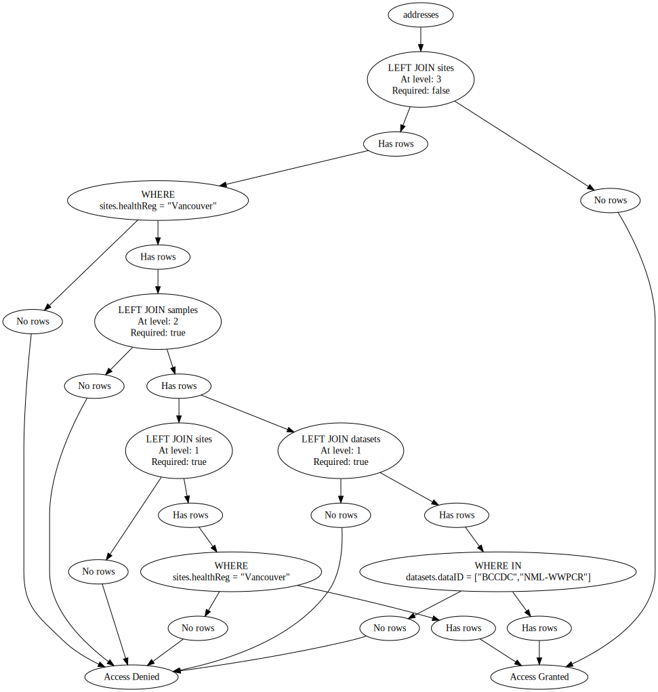


### bccdc -> organizations


### bccdc -> datasets

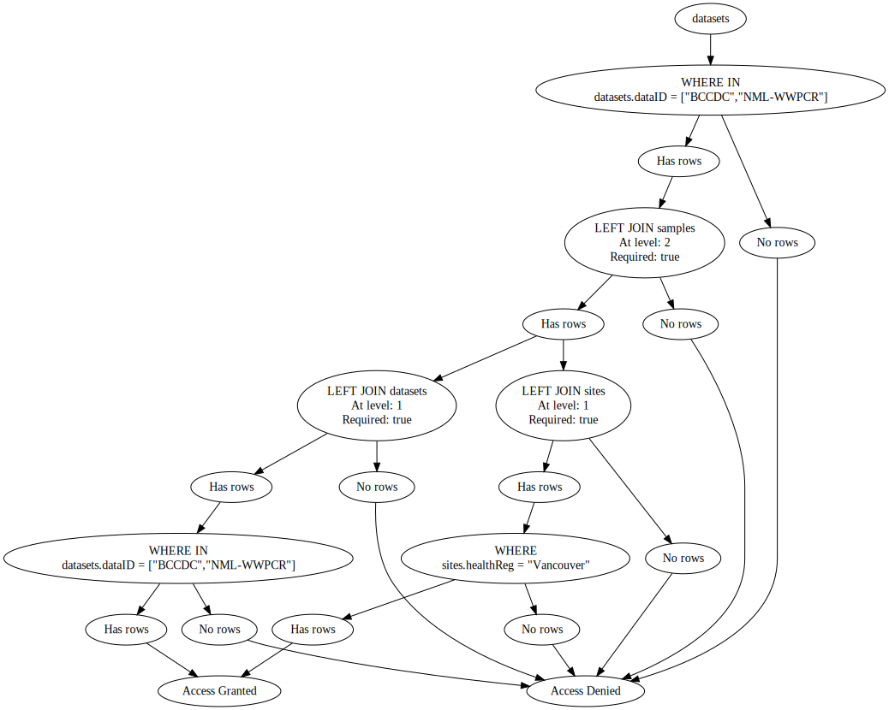


### bccdc -> polygons


### bccdc -> instruments


### bccdc -> optionSets


### bccdc -> setLUs


### bccdc -> partLUs


### bccdc -> contacts

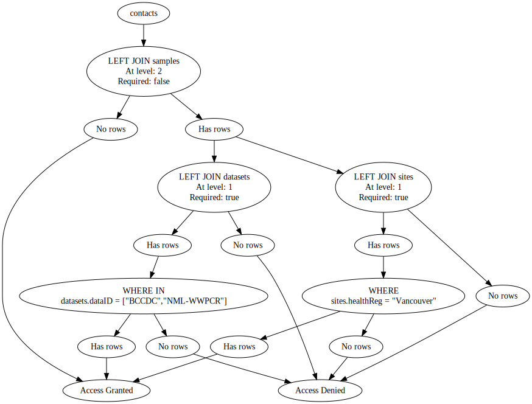


### bccdc -> measureSets


### bccdc -> methodSteps


### bccdc -> methodSets

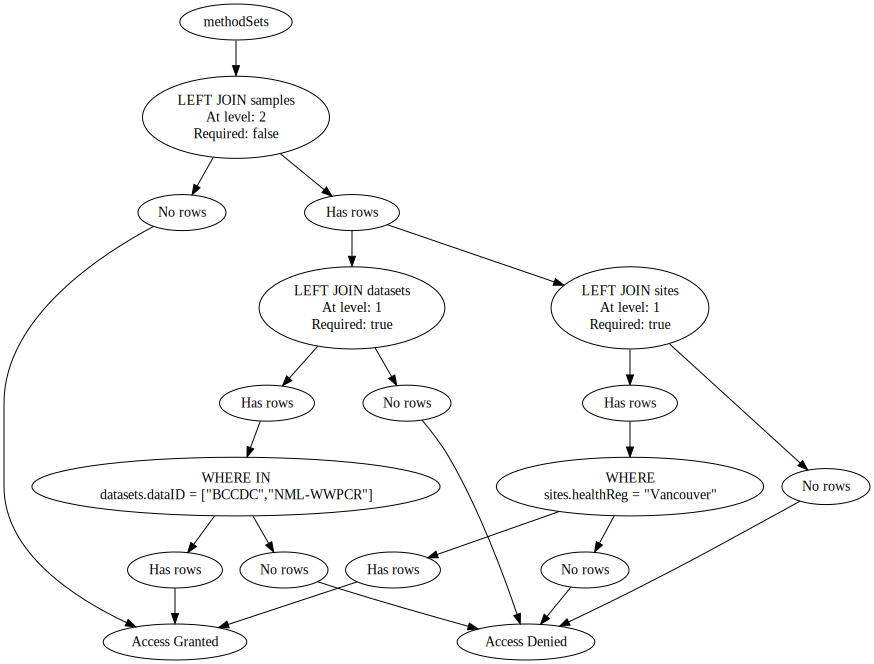


### bccdc -> languageLUs


### bccdc -> translationLUs


### bccdc -> sites


### bccdc -> samples


### bccdc -> measures


### hnj -> addresses


### hnj -> organizations

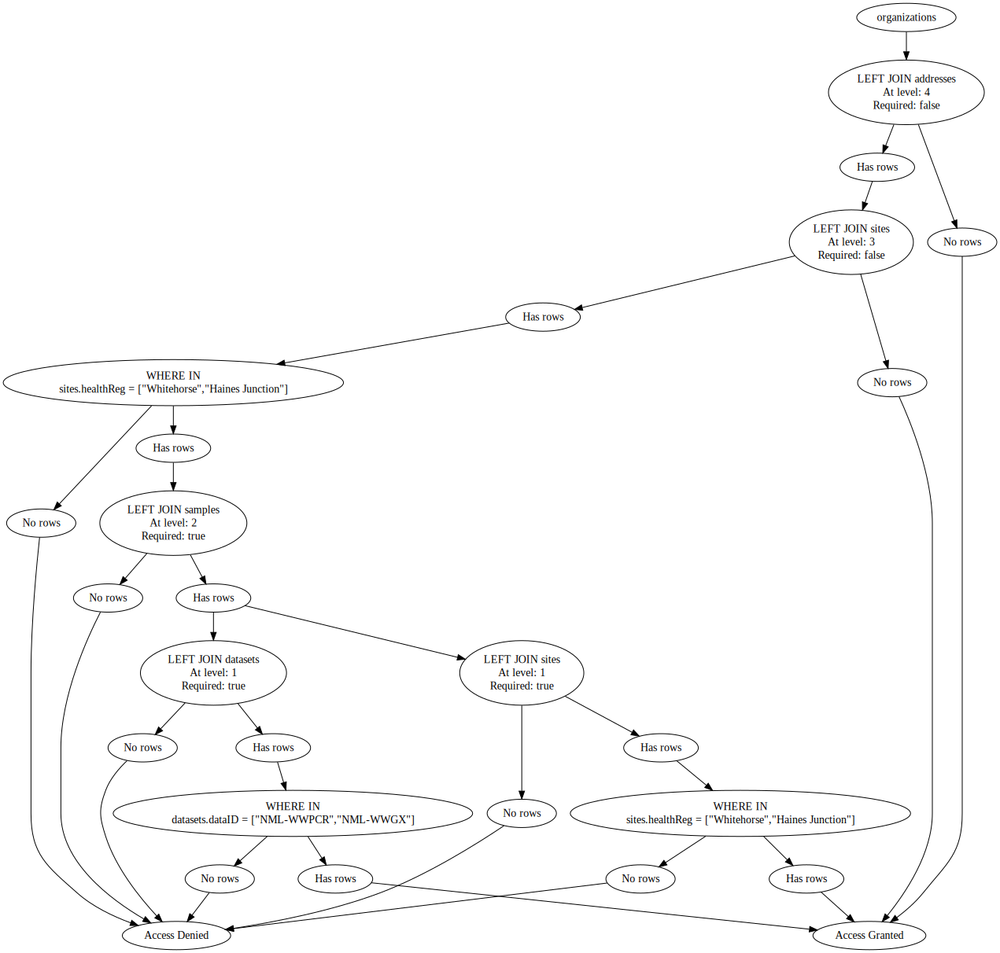


### hnj -> datasets


### hnj -> polygons


### hnj -> instruments


### hnj -> optionSets


### hnj -> setLUs


### hnj -> partLUs


### hnj -> contacts

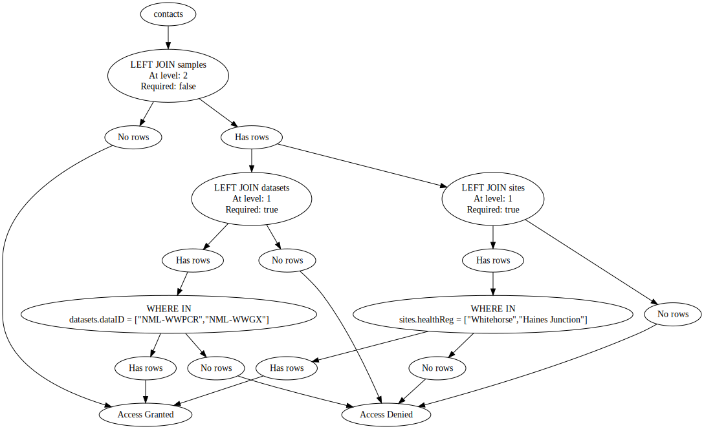


### hnj -> measureSets

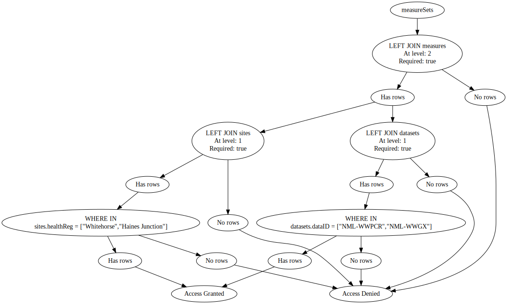


### hnj -> methodSteps


### hnj -> methodSets

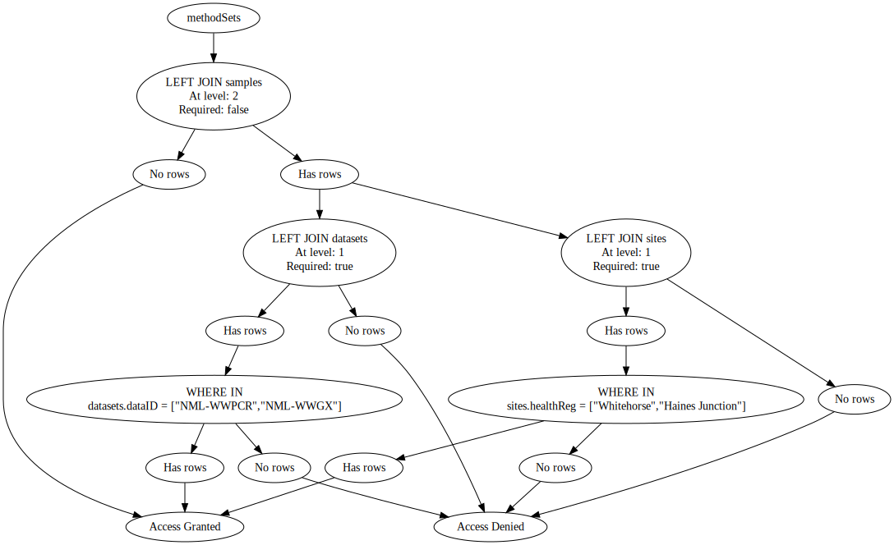


### hnj -> languageLUs


### hnj -> translationLUs


### hnj -> sites


### hnj -> samples

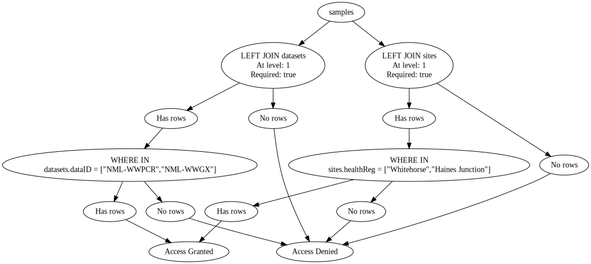


### hnj -> measures


